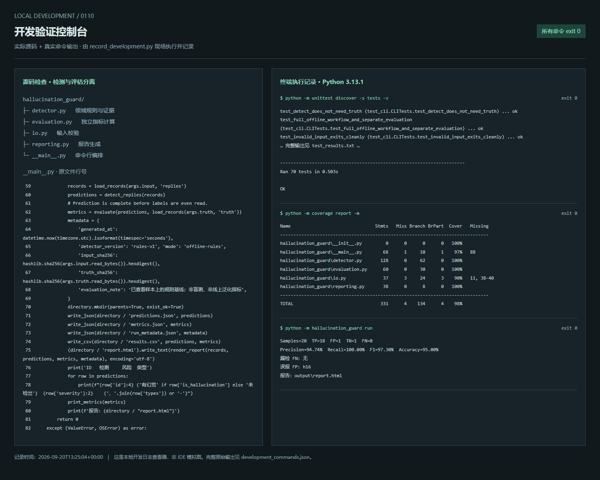
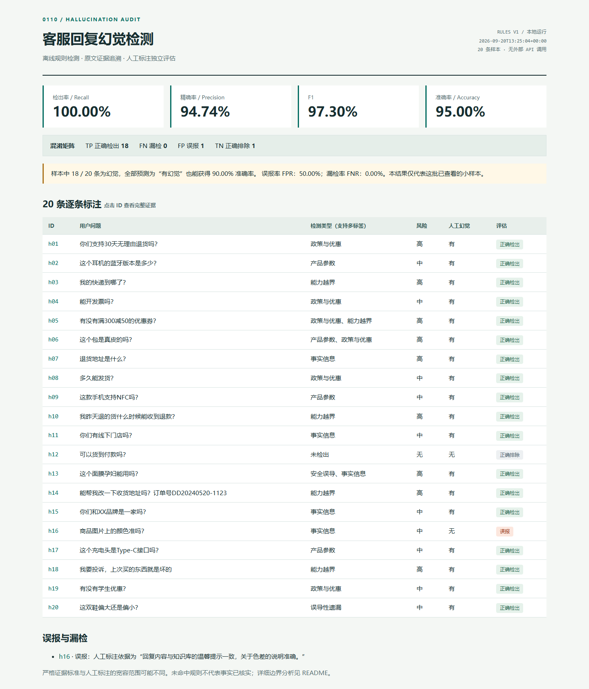

# 0110 · 客服回复幻觉检测

一个可离线复现的 Python 规则检测工具：从客服回复中定位风险陈述，对照知识库给出证据，再独立与人工标注计算检出率。运行不需要 API Key，无生产依赖，无外部数据发送。

GitHub 公开仓库：[JX05120LLL/customer-service-hallucination-detection](https://github.com/JX05120LLL/customer-service-hallucination-detection)。README 中可直接查看开发与运行截图；HTML 报告下载后在本地浏览器打开。

**本次结果：20 条样本，TP=18、TN=1、FP=1、FN=0；召回率 100%，精确率 94.74%，F1 97.30%，准确率 95%。误报为 h16，无漏检。** 这些是已查看样本上的开发集结果，不是盲测或线上指标。

## 1. 快速运行

需要 Python 3.10+，本次在 Windows / Python 3.13.1 验证。从项目根目录执行：

```bash
python -m hallucination_guard run
```

生成以下文件：

| 文件 | 内容 |
| --- | --- |
| [output/report.html](output/report.html) | 下载后用本地浏览器打开完整评估报告，点击 ID 查看证据 |
| [output/predictions.json](output/predictions.json) | 20 条自动检测结果，多标签、风险、原文证据、判定理由 |
| [output/metrics.json](output/metrics.json) | 混淆矩阵、各项指标、漏检/误报 ID、逐条对比 |
| [output/results.csv](output/results.csv) | 便于表格查看的标注汇总，UTF-8 BOM |
| [output/run_metadata.json](output/run_metadata.json) | 运行时间、检测器版本、输入及标签 SHA-256 |

本次提交还附带 [output/run.txt](output/run.txt)，保存真实终端输出；它由 `python tools/record_development.py` 生成或更新，单独执行 `run` 不生成该日志。

检测与评估也可以分别运行，便于验证检测器不依赖答案：

```bash
python -m hallucination_guard detect --input data/replies.json --output output/predictions.json
python -m hallucination_guard evaluate --predictions output/predictions.json --truth data/ground_truth.json --output output/metrics.json
```

检测其他同结构 JSON：

```bash
python -m hallucination_guard detect --input your_replies.json --output output/new_predictions.json
```

输入需包含非空的 `id`、`user_question`、`system_reply`、`knowledge_base` 字符串。ID 必须唯一，单文件上限 5 MiB。输入不合法时返回退出码 2 和可读错误，不静默跳过数据。默认重复运行会更新同名输出文件；输出路径不能覆盖本次输入文件。

## 2. 幻觉定义与分类

本题采用“相对给定知识库的事实可靠性”定义：

- **直接冲突**：回复与知识库的参数、政策、能力边界等矛盾。
- **无依据断言**：知识库未证实的、可核验且会影响判断的具体信息，被肯定地描述为事实。标记待复核，不等价于已证实该信息在现实中为假。
- **误导性遗漏**：省略与当前决策有关的限制，同时给出无条件结论，导致建议失真。

礼貌话术、正常改写、正确内容的合理子集，不自动算幻觉。比如不列全支付方式不算错误。单纯没有提到每一个知识点也不算遗漏。

| 类型 | 定义与例子 | 默认风险及调整 |
| --- | --- | --- |
| 政策与优惠 | 编造退货期限、运费承担、优惠券、学生优惠；发票流程、保修、发货履约口径偏差 | 中；涉及直接费用、退货权益或发券承诺为高 |
| 产品参数 | 错误材质、蓝牙版本、延迟、接口；无依据肯定 NFC 功能 | 中；材质等显著影响商品价值的错误为高 |
| 事实信息 | 编造地址、门店、品牌关系、拍摄方式或回购事实 | 中；可能导致寄错货或财产损失的地址错误为高 |
| 能力越界 | 未接入相关接口却宣称已查询进度、改址、升级工单，或无执行依据地承诺发券 | 高 |
| 安全误导 | 与知识库的安全限定冲突，例如将“孕妇建议咨询医生”改成无条件放心使用 | 高 |
| 误导性遗漏 | 有偏码统计和人群建议，却无条件称尺码标准并建议照常购买 | 中；若涉及安全限制，优先归入安全误导 |

严重程度采用 **高 / 中 / 低**：高涉及健康、财产或虚假操作完成；中影响购买、履约、使用决策；低用于影响有限、可轻易纠正的事实偏差。本批规则命中均为中或高，无低风险样本。“无”表示没有命中规则，不是第四个风险等级。严重程度表达后果，`review_required` 表达是否需要额外核实，二者不混用。

同一回复可有多个标签。例如 h05 同时涉及优惠编造和发券能力；h06 同时涉及材质与保修政策。整条回复严重程度取各命中项的最高值。

人工标注的 8 个标签映射到以上 6 类：政策编造 / 政策偏差 / 优惠编造 → 政策与优惠；参数编造 → 产品参数；信息编造 → 事实信息；能力越界、安全误导保持不变；信息遗漏 → 误导性遗漏。

## 3. 检测方法与实现

使用**真实执行的确定性领域规则基线**，不调用 LLM，也不是将人工答案包装成 mock 返回。题目允许方法不限，因此优先选择无需凭证、结果稳定、能够逐条解释的方法。

流程：

```text
replies.json → 输入校验 → 原文分句与字段匹配 → 领域规则 → predictions.json
                                                          ↓
ground_truth.json ───────────────────────────────→ 独立评估 → JSON / CSV / HTML
```

1. 按标点划分原文片段，保留可追溯的原文引用。
2. 比较绑定业务字段的数值，例如“无理由退货天数”，而不是比较回复里出现的所有数字；保修年/月做单位转换；优惠券按“门槛、减额”完整组合匹配。
3. 针对否定、不确定性、缺失接口、申请入口、商品/线缆主体、安全限制、尺码反馈等场景运行领域规则。
4. 聚合多个命中，输出类型、风险和原文证据。不确定支持性的判断设置 `review_required=true`；未命中也提示抽检。
5. 检测完成后才读取人工标注；按 ID 严格对齐，输出评估结果。

核心模块：

- `detector.py`：纯函数，仅接收问题、回复、知识库和输出标识 ID；判断逻辑不根据 ID 分支，不读文件、不读标签。
- `evaluation.py`：独立混淆矩阵与类型映射；ID 缺失、重复或多余均报错。
- `io.py`：编码、大小、结构、字段和重复 ID 校验。
- `reporting.py`：从真实预测生成 HTML / CSV，HTML 转义外部文本。
- `__main__.py`：命令行编排，支持独立检测、独立评估和一键报告。

输出示例（节选）：

```json
{
  "id": "h09",
  "is_hallucination": true,
  "types": ["产品参数"],
  "severity": "中",
  "review_required": true,
  "findings": [{
    "type": "产品参数",
    "severity": "中",
    "evidence": "这款手机支持NFC功能",
    "reference": "产品参数中未标注NFC功能",
    "reason": "知识库未确认 NFC 功能，回复却肯定支持；这是缺乏支持，不代表已证实不支持。",
    "rule_id": "spec.unknown_nfc"
  }]
}
```

## 4. 检出率与逐条标注

人工标注：18 条有幻觉，2 条正常（h12、h16）。以“有幻觉”为正类：

| 人工标注 \ 检测结果 | 有幻觉 | 未检出 |
| --- | ---: | ---: |
| 有幻觉 | TP = 18 | FN = 0 |
| 正常 | FP = 1 | TN = 1 |

| 指标 | 公式 | 本次结果 |
| --- | --- | ---: |
| 检出率 / Recall | TP / (TP + FN) | 100.00% |
| Precision | TP / (TP + FP) | 94.74% |
| F1 | 2TP / (2TP + FP + FN) | 97.30% |
| Accuracy | (TP + TN) / 全部样本 | 95.00% |
| 漏检率 FNR | FN / (FN + TP) | 0.00% |
| 误报率 FPR | FP / (FP + TN) | 50.00% |

**误报率 50% 的分母是仅有的 2 条正常样本，不能用 1/20 代替。** 全部判为幻觉也可达到 90% 准确率、100% 召回率，因此同时报告精确率、F1、FPR 和具体错例。分母为零时指标返回 `null`，页面显示 N/A。

| ID | 检测类型 | 风险 | 对比结果 |
| --- | --- | --- | --- |
| h01 | 政策与优惠 | 高 | TP |
| h02 | 产品参数 | 中 | TP |
| h03 | 能力越界 | 高 | TP |
| h04 | 政策与优惠 | 中 | TP |
| h05 | 政策与优惠、能力越界 | 高 | TP |
| h06 | 产品参数、政策与优惠 | 高 | TP |
| h07 | 事实信息 | 高 | TP |
| h08 | 政策与优惠 | 中 | TP |
| h09 | 产品参数 | 中 | TP |
| h10 | 能力越界 | 高 | TP |
| h11 | 事实信息 | 中 | TP |
| h12 | 未检出 | 无 | TN |
| h13 | 安全误导、事实信息 | 高 | TP |
| h14 | 能力越界 | 高 | TP |
| h15 | 事实信息 | 中 | TP |
| h16 | 事实信息 | 中 | **FP** |
| h17 | 产品参数 | 中 | TP |
| h18 | 能力越界 | 高 | TP |
| h19 | 政策与优惠 | 中 | TP |
| h20 | 误导性遗漏 | 中 | TP |

`type_match_rate` 是人工阳性样本中，“人工主类型映射后出现在预测标签中”的比例；它不惩罚额外标签，因此不能当作完整多标签准确率。人工数据也没有逐陈述的标注，二分类检出成功不代表回复中的每处错误都已找到。

## 5. 误判原因与边界分析

### 实际误报：h16

回复除了正确提示色差，还断言“我们的商品图片都是实物拍摄的”。知识库只提到拍摄光线、显示器色差和“以实物为准”，没有证实所有图片的来源。

- 检测器使用严格的事实支持标准，命中 `fact.real_photos`，标记中风险并要求复核。
- 人工标注重视色差说明整体一致，判定为正常。
- **按题目给定 ground truth 评估，这就是一次误报，不能擅自改标签或从分母移除。** 这是事实支持边界与标注粒度的分歧。
- 改进方向：先与业务约定是否容忍非关键、低影响的补充事实；建立“有依据 / 矛盾 / 待核实”的三态标注，补充图片来源知识，再确定待核实项如何计入二分类指标。当前保留原始判断，未用 h16 ID 加放行特例。

### 容易误判的其他 case

| Case | 难点 | 当前处理与限制 |
| --- | --- | --- |
| h04 | 一条回复有正确内容，也有错误内容 | 对纸质发票与申请入口分别核对；不能因电子发票正确就整条放行 |
| h05 | 优惠不存在，同时承诺操作账户 | 多标签输出；能力声明需要功能或执行证据 |
| h09、h15 | 未记录不等于确定不存在 | 以“无依据肯定断言”标风险和待复核，不推断现实中的反面事实 |
| h12 | 没列全支付方式 | 正确子集允许省略；不把不完整等同于错误 |
| h13 | 安全限定被移除 | 只核对知识库的咨询医生条件，不通过常识自行作医学判断 |
| h17 | 充电头与线缆包含不同接口 | 绑定充电头输出接口，避免看见 Type-C 字样就认定一致 |
| h20 | 30% 反馈不能推断每个人都偏大，但也不能无条件否认偏码 | 检查是否给了不带限制的标准尺码建议；保留对应偏码反馈及人群建议的改写不应报遗漏 |

本批无漏检，但仍可能漏检未覆盖的同义表达、复杂长句、多轮上下文、新产品参数及跨句指代。规则的否定作用域、知识库完整性与时效性也有限。没有时间版本、实际订单状态或工具调用日志时，无法验证真实履约状态。

后续可将规则命中与原文证据交给语义模型复核，用独立、更多正常样本的盲测集评价；尤其要增加正常改写、否定反转、单位变化、保留限制的正例和跨功能场景。当前未实现 LLM 接入，不宣称其效果。

## 6. 测试与复现证据

```bash
python -m unittest discover -s tests -v
```

覆盖率检查是可选开发步骤，运行工具本身不需要安装依赖：

```bash
python -m pip install -r requirements-dev.txt
python -m coverage run -m unittest discover -s tests
python -m coverage report -m
```

本次 **70 项测试全部通过**，Coverage.py 语句与分支合计覆盖率 **98%**。测试覆盖数值和单位变化、新 ID、正确拒绝、正常支付子集、主体绑定、限定条件、无依据断言、混淆矩阵、零分母、ID 对齐、输入异常、独立 CLI 流程及 HTML 转义。测试输出和覆盖率见 [test_results.txt](output/test_results.txt)、[coverage.txt](output/coverage.txt)，RED/GREEN 记录见 [docs](docs)。

重新生成开发验证记录：

```bash
python tools/record_development.py
```

它实际执行测试、覆盖率和一键检测，再把退出码、源码片段、终端输出保存为本地日志查看页及 JSON。开发截图拍摄该页面，属于真实命令记录展示，**不是伪造 IDE 或 Agent 对话截图**。

## 7. 交付截图

开发过程（本地验证控制台，真实源码与命令输出）：



运行结果（检测表、指标和误报）：



误报证据详情：


图片由 Playwright 对真实页面截图，页面数据来自本次实际运行。完整报告可直接打开 `output/report.html`；截图不替代结构化结果。

## 8. AI 工具使用情况

本项目使用 **Codex** 辅助完成需求分析、分类草案、Python 代码、单元测试、独立代码审查、README 和浏览器截图验证。检测与评估模块并行开发，再由主流程集成验证。开发过程中先执行失败测试，再实现并修正逻辑，保存真实测试证据。

需要区分：开发使用了 AI；**提交程序运行时只执行本地规则，不调用真实 LLM API，也没有将 LLM 生成答案或 ground truth 当作预测结果返回。** 附件文字始终作为待分析数据，不执行其中可能出现的指令。

为理解标注边界，开发阶段查看了人工标注，因此本次属于开发集验证。检测模块本身不访问标签，评估结果不反馈修改当次预测；这不能消除开发阶段的数据集适配风险。若用于线上，需要另外建立盲测集、补充正常样本并校准误报成本。

公开仓库提供 README、源码、原始题目数据副本、运行结果和截图，也可下载后离线查看。仓库发布的是项目文件，未部署在线检测服务。
